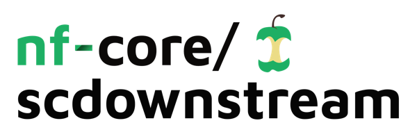
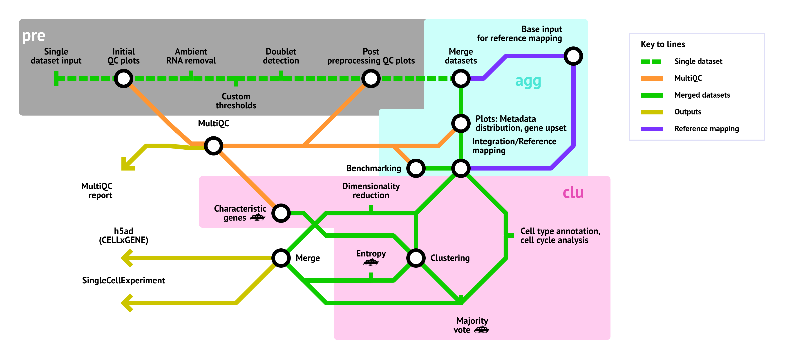

<h1>
  <picture>
    <source media="(prefers-color-scheme: dark)" srcset="docs/images/nf-core-scdownstream_logo_dark.png">
    
  </picture>
</h1>

[](https://github.com/nf-core/scdownstream/actions/workflows/ci.yml)
[](https://github.com/nf-core/scdownstream/actions/workflows/linting.yml)[](https://nf-co.re/scdownstream/results)[](https://doi.org/10.5281/zenodo.XXXXXXX)
[](https://www.nf-test.com)

[](https://www.nextflow.io/)
[](https://docs.conda.io/en/latest/)
[](https://www.docker.com/)
[](https://sylabs.io/docs/)
[](https://cloud.seqera.io/launch?pipeline=https://github.com/nf-core/scdownstream)

[](https://nfcore.slack.com/channels/scdownstream)[](https://twitter.com/nf_core)[](https://mstdn.science/@nf_core)[](https://www.youtube.com/c/nf-core)

## Introduction

**nf-core/scdownstream** is a bioinformatics pipeline that can be used to process already quantified single-cell RNA-seq data. It takes a samplesheet and h5ad-, SingleCellExperiment/Seurat- or CSV files as input and performs quality control, integration, dimensionality reduction and clustering. It produces an integrated h5ad and SingleCellExperiment file and an extensive QC report.

# 

Not all of the steps shown in the metromap have already been implemented, as this pipeline is still under development. However, the following steps are already functional:

1. Per-sample preprocessing
   1. Convert all RDS files to h5ad format
   2. Present QC for raw counts ([`MultiQC`](http://multiqc.info/))
   3. Apply user-defined QC filters (can be defined per sample in the samplesheet)
   4. Remove ambient RNA
      - [decontX](https://bioconductor.org/packages/release/bioc/html/decontX.html)
      - [soupX](https://cran.r-project.org/web/packages/SoupX/readme/README.html)
      - [cellbender](https://cellbender.readthedocs.io/en/latest/)
      - [scAR](https://docs.scvi-tools.org/en/stable/user_guide/models/scar.html)
   5. Doublet detection (Majority vote possible)
      - [SOLO](https://docs.scvi-tools.org/en/stable/user_guide/models/solo.html)
      - [scrublet](https://scanpy.readthedocs.io/en/stable/api/generated/scanpy.pp.scrublet.html)
      - [DoubletDetection](https://doubletdetection.readthedocs.io/en/v2.5.2/doubletdetection.doubletdetection.html)
      - [SCDS](https://bioconductor.org/packages/devel/bioc/vignettes/scds/inst/doc/scds.html)
2. Sample aggregation
   1. Merge into a single h5ad file
   2. Present QC for merged counts ([`MultiQC`](http://multiqc.info/))
   3. Integration
      - [scVI](https://docs.scvi-tools.org/en/stable/user_guide/models/scvi.html)
      - [scANVI](https://docs.scvi-tools.org/en/stable/user_guide/models/scanvi.html)
      - [Harmony](https://portals.broadinstitute.org/harmony/articles/quickstart.html)
      - [BBKNN](https://github.com/Teichlab/bbknn)
      - [Combat](https://scanpy.readthedocs.io/en/latest/api/generated/scanpy.pp.combat.html)
      - [Seurat](https://satijalab.org/seurat/articles/integration_introduction)
3. Cell type annotation
   - [celltypist](https://www.celltypist.org/)
4. Clustering and dimensionality reduction
   1. [Leiden clustering](https://scanpy.readthedocs.io/en/stable/generated/scanpy.tl.leiden.html)
   2. [UMAP](https://scanpy.readthedocs.io/en/stable/generated/scanpy.tl.umap.html)

## Usage

> [!NOTE]
> If you are new to Nextflow and nf-core, please refer to [this page](https://nf-co.re/docs/usage/installation) on how to set-up Nextflow. Make sure to [test your setup](https://nf-co.re/docs/usage/introduction#how-to-run-a-pipeline) with `-profile test` before running the workflow on actual data.

First, prepare a samplesheet with your input data that looks as follows:

`samplesheet.csv`:

```csv
sample,file
sample1,/absolute/path/to/sample1.h5ad
sample2,relative/path/to/sample2.rds
sample3,/absolute/path/to/sample3.csv
```

Each row represents a h5ad, RDS or CSV file. RDS files may contain any object that can be converted to a SingleCellExperiment using the [Seurat `as.SingleCellExperiment`](https://satijalab.org/seurat/reference/as.singlecellexperiment) function.
CSV files should contain a matrix with genes as columns and cells as rows. The first column should contain cell names/barcodes.

-->

Now, you can run the pipeline using:

```bash
nextflow run nf-core/scdownstream \
   -profile <docker/singularity/.../institute> \
   --input samplesheet.csv \
   --outdir <OUTDIR>
```

> [!WARNING]
> Please provide pipeline parameters via the CLI or Nextflow `-params-file` option. Custom config files including those provided by the `-c` Nextflow option can be used to provide any configuration _**except for parameters**_;
> see [docs](https://nf-co.re/usage/configuration#custom-configuration-files).

For more details and further functionality, please refer to the [usage documentation](https://nf-co.re/scdownstream/usage) and the [parameter documentation](https://nf-co.re/scdownstream/parameters).

## Pipeline output

To see the results of an example test run with a full size dataset refer to the [results](https://nf-co.re/scdownstream/results) tab on the nf-core website pipeline page.
For more details about the output files and reports, please refer to the
[output documentation](https://nf-co.re/scdownstream/output).

## Credits

nf-core/scdownstream was originally written by Nico Trummer.

<!-- TODO nf-core: If applicable, make list of people who have also contributed

We thank the following people for their extensive assistance in the development of this pipeline:
 -->

## Contributions and Support

If you would like to contribute to this pipeline, please see the [contributing guidelines](.github/CONTRIBUTING.md).

For further information or help, don't hesitate to get in touch on the [Slack `#scdownstream` channel](https://nfcore.slack.com/channels/scdownstream) (you can join with [this invite](https://nf-co.re/join/slack)).

## Citations

<!-- TODO nf-core: Add citation for pipeline after first release. Uncomment lines below and update Zenodo doi and badge at the top of this file. -->
<!-- If you use nf-core/scdownstream for your analysis, please cite it using the following doi: [10.5281/zenodo.XXXXXX](https://doi.org/10.5281/zenodo.XXXXXX) -->

<!-- TODO nf-core: Add bibliography of tools and data used in your pipeline -->

An extensive list of references for the tools used by the pipeline can be found in the [`CITATIONS.md`](CITATIONS.md) file.

You can cite the `nf-core` publication as follows:

> **The nf-core framework for community-curated bioinformatics pipelines.**
>
> Philip Ewels, Alexander Peltzer, Sven Fillinger, Harshil Patel, Johannes Alneberg, Andreas Wilm, Maxime Ulysse Garcia, Paolo Di Tommaso & Sven Nahnsen.
>
> _Nat Biotechnol._ 2020 Feb 13. doi: [10.1038/s41587-020-0439-x](https://dx.doi.org/10.1038/s41587-020-0439-x).
