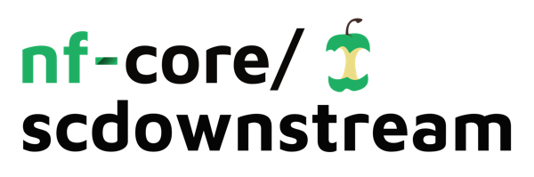
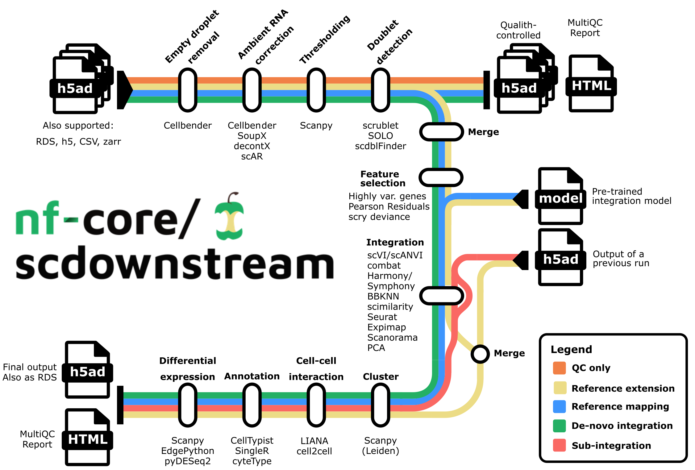

<h1>
  <picture>
    <source media="(prefers-color-scheme: dark)" srcset="docs/images/nf-core-scdownstream_logo_dark.png">
    
  </picture>
</h1>

[](https://github.com/codespaces/new/nf-core/scdownstream)
[](https://github.com/nf-core/scdownstream/actions/workflows/nf-test.yml)
[](https://github.com/nf-core/scdownstream/actions/workflows/linting.yml)[](https://nf-co.re/scdownstream/results)[](https://doi.org/10.5281/zenodo.XXXXXXX)
[](https://www.nf-test.com)

[](https://www.nextflow.io/)
[](https://github.com/nf-core/tools/releases/tag/4.0.2)
[](https://docs.conda.io/en/latest/)
[](https://www.docker.com/)
[](https://sylabs.io/docs/)
[](https://cloud.seqera.io/launch?pipeline=https://github.com/nf-core/scdownstream)

[](https://nfcore.slack.com/channels/scdownstream)[](https://bsky.app/profile/nf-co.re)[](https://mstdn.science/@nf_core)[](https://www.youtube.com/c/nf-core)

## Introduction

**nf-core/scdownstream** is a bioinformatics pipeline that can be used to process already quantified single-cell RNA-seq data.
It takes a samplesheet and H5AD-, SingleCellExperiment/Seurat- or CSV files as input and performs quality control, integration, dimensionality reduction and clustering.
The pipeline produces an integrated H5AD and SingleCellExperiment file and an extensive QC report.

The pipeline is based on the learnings and implementations from the following pipelines (alphabetical):

- [panpipes](https://github.com/DendrouLab/panpipes)
- [scFlow](https://combiz.github.io/scFlow/)
- [scRAFIKI](https://github.com/Mye-InfoBank/scRAFIKI)
- [YASCP](https://github.com/wtsi-hgi/yascp)

# 

Steps marked with the boat icon are not yet implemented. For the other steps, the pipeline uses the following tools:

1. Per-sample preprocessing
   1. Convert all RDS files to H5AD format
   2. Create filtered matrix (if not provided)
   3. Present QC for raw counts ([`MultiQC`](http://multiqc.info/))
   4. Remove ambient RNA
      - [DecontX](https://bioconductor.org/packages/release/bioc/html/decontX.html)
      - [SoupX](https://cran.r-project.org/web/packages/SoupX/readme/README.html)
      - [CellBender](https://cellbender.readthedocs.io/en/latest/)
      - [scAR](https://docs.scvi-tools.org/en/stable/user_guide/models/scar.html)
   5. Apply user-defined QC filters (can be defined per sample in the samplesheet)
   6. Doublet detection (Majority vote possible)
      - [SOLO](https://docs.scvi-tools.org/en/stable/user_guide/models/solo.html)
      - [Scrublet](https://scanpy.readthedocs.io/en/stable/api/generated/scanpy.pp.scrublet.html)
      - [DoubletDetection](https://doubletdetection.readthedocs.io/en/v2.5.2/doubletdetection.doubletdetection.html)
      - [scDblFinder](https://bioconductor.org/packages/release/bioc/html/scDblFinder.html)
   7. Cell cycle scoring ([Tirosh et al. 2015](https://doi.org/10.1038/nature14590))
2. Sample aggregation
   1. Merge into a single H5AD file
   2. Present QC for merged counts ([`MultiQC`](http://multiqc.info/))
   3. Integration
      - [scVI](https://docs.scvi-tools.org/en/stable/user_guide/models/scvi.html)
      - [scANVI](https://docs.scvi-tools.org/en/stable/user_guide/models/scanvi.html)
      - [Harmony](https://portals.broadinstitute.org/harmony/articles/quickstart.html)
      - [Symphony](https://symphonypy.readthedocs.io/) (via [symphonypy](https://pypi.org/project/symphonypy/))
      - [BBKNN](https://github.com/Teichlab/bbknn)
      - [Combat](https://scanpy.readthedocs.io/en/latest/api/generated/scanpy.pp.combat.html)
      - [Seurat](https://satijalab.org/seurat/articles/integration_introduction)
      - [PCA](https://scanpy.readthedocs.io/en/stable/generated/scanpy.pp.pca.html)
      - [scimilarity](https://github.com/Genentech/scimilarity)
      - [Expimap](https://docs.scarches.org/en/latest/api/models.html#scarches.models.EXPIMAP)
3. Cell type annotation
   - [CellTypist](https://www.celltypist.org/)
   - [SingleR](https://www.bioconductor.org/packages/release/bioc/html/SingleR.html)
   - [CyteType](https://github.com/NygenAnalytics/cytetype)
4. Clustering and dimensionality reduction
   1. [Leiden clustering](https://scanpy.readthedocs.io/en/stable/generated/scanpy.tl.leiden.html)
   2. [UMAP](https://scanpy.readthedocs.io/en/stable/generated/scanpy.tl.umap.html)
5. Create [Quarto](https://quarto.org/) and ([`MultiQC`](http://multiqc.info/)) reports

## Usage

> [!NOTE]
> If you are new to Nextflow and nf-core, please refer to [this page](https://nf-co.re/docs/get_started/environment_setup/overview) on how to set-up Nextflow. Make sure to [test your setup](https://nf-co.re/docs/get_started/run-your-first-pipeline) with `-profile test` before running the workflow on actual data.

> [!NOTE]
> If you are confused by the terms `filtered` and `unfiltered`, please check out the respective [documentation](https://nf-co.re/scdownstream/dev/docs/usage/#filtered-and-unfiltered-matrices).

First, prepare a samplesheet with your input data that looks as follows:

```csv title="samplesheet.csv"
sample,unfiltered
sample1,/absolute/path/to/sample1.h5ad
sample2,/absolute/path/to/sample3.h5
sample3,relative/path/to/sample2.rds
sample4,/absolute/path/to/sample3.csv
```

Each entry represents a H5AD, H5, RDS or CSV file.
RDS files may contain any object that can be converted to a SingleCellExperiment using the [Seurat `as.SingleCellExperiment`](https://satijalab.org/seurat/reference/as.singlecellexperiment) function.
CSV files should contain a matrix with genes as columns and cells as rows. The first column should contain cell names/barcodes.

-->

Now, you can run the pipeline using:

```bash
nextflow run nf-core/scdownstream \
   -profile <docker/singularity/.../institute> \
   --input samplesheet.csv \
   --outdir <OUTDIR>
```

> [!WARNING]
> Please provide pipeline parameters via the CLI or Nextflow `-params-file` option. Custom config files including those provided by the `-c` Nextflow option can be used to provide any configuration _**except for parameters**_; see [docs](https://nf-co.re/docs/running/run-pipelines#using-parameter-files).

For more details and further functionality, please refer to the [usage documentation](https://nf-co.re/scdownstream/usage) and the [parameter documentation](https://nf-co.re/scdownstream/parameters).

## Pipeline output

To see the results of an example test run with a full size dataset refer to the [results](https://nf-co.re/scdownstream/results) tab on the nf-core website pipeline page.
For more details about the output files and reports, please refer to the [output documentation](https://nf-co.re/scdownstream/output).

## Credits

nf-core/scdownstream was originally written by [Nico Trummer](https://github.com/nictru).

We thank the following people for their extensive assistance in the development of this pipeline (alphabetical):

- [Erik Fasterius](https://github.com/fasterius)
- [Fabian Rost](https://github.com/fbnrst)
- [Fabiola Curion](https://github.com/bio-la)
- [Gregor Sturm](https://github.com/grst)
- [Jonathan Talbot-Martin](https://github.com/jtalbotmartin)
- [Lukas Heumos](https://github.com/zethson)
- [Matiss Ozols](https://github.com/maxozo)
- [Nathan Skene](https://github.com/NathanSkene)
- [Nurun Fancy](https://github.com/nfancy)
- [Riley Grindle](https://github.com/Riley-Grindle)
- [Ryan Seaman](https://github.com/RPSeaman)
- [Steffen Möller](https://github.com/smoe)
- [Wojtek Sowinski](https://github.com/WojtekSowinski)

## Contributions and Support

If you would like to contribute to this pipeline, please see the [contributing guidelines](docs/CONTRIBUTING.md).

For further information or help, don't hesitate to get in touch on the [Slack `#scdownstream` channel](https://nfcore.slack.com/channels/scdownstream) (you can join with [this invite](https://nf-co.re/join/slack)).

## Citations

<!-- TODO nf-core: Add citation for pipeline after first release. Uncomment lines below and update Zenodo doi and badge at the top of this file. -->
<!-- If you use nf-core/scdownstream for your analysis, please cite it using the following doi: [10.5281/zenodo.XXXXXX](https://doi.org/10.5281/zenodo.XXXXXX) -->

<!-- TODO nf-core: Add bibliography of tools and data used in your pipeline -->

An extensive list of references for the tools used by the pipeline can be found in the [`CITATIONS.md`](CITATIONS.md) file.

You can cite the `nf-core` publication as follows:

> **The nf-core framework for community-curated bioinformatics pipelines.**
>
> Philip Ewels, Alexander Peltzer, Sven Fillinger, Harshil Patel, Johannes Alneberg, Andreas Wilm, Maxime Ulysse Garcia, Paolo Di Tommaso & Sven Nahnsen.
>
> _Nat Biotechnol._ 2020 Feb 13. doi: [10.1038/s41587-020-0439-x](https://dx.doi.org/10.1038/s41587-020-0439-x).
